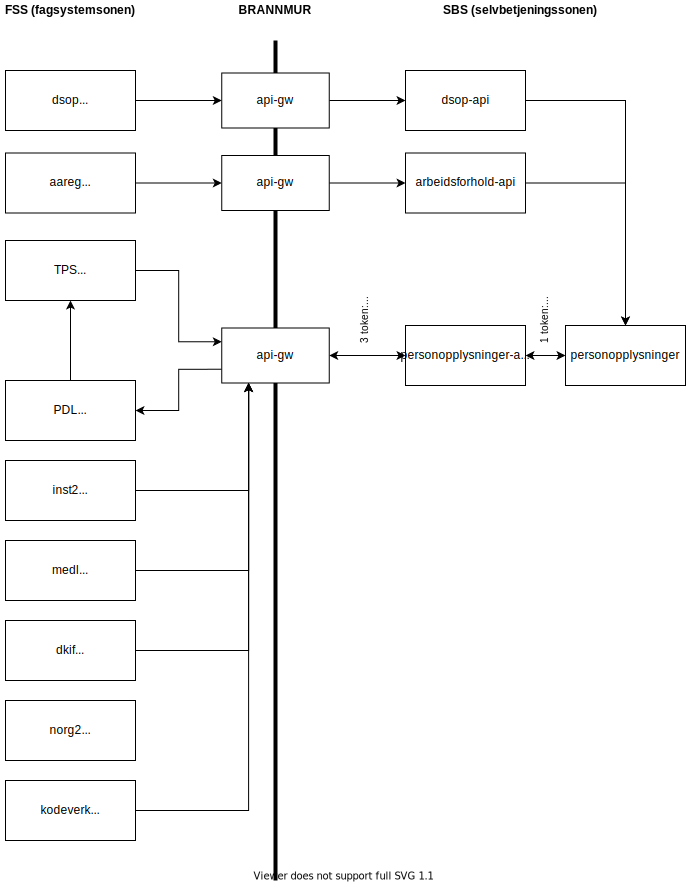

# Personopplysninger-API

 | 

Spring Boot backend som skal gi brukeren innsikt i informasjonen NAV har lagret. 

## Deploy til dev-miljø

[Deploy-to-dev](https://github.com/navikt/personopplysninger-api/actions/workflows/deploy.dev.yml) -> Run workflow -> Velg branch -> Run workflow

## Prodsetting

Publiser en ny release på master for å starte deploy til prod

## Lokalt Kjøring

For å kjøre opp løsningen lokalt <br>
Kjør [TestLauncher](src/test/java/no/nav/personopplysninger/api/TestLauncher.java).

## Teste endepunkter i Q

Endepunkter for å oppdatere brukeropplysninger kan gjøres via CLI med følgende kommando:

```
curl --insecure -XPOST "https://www.dev.nav.no/person/personopplysninger-api/endreTelefonnummer" -H "accept: application/json" -H "Authorization: Bearer OIDC-TOKEN" -H "Nav-Call-Id: 123456" -H "Nav-Consumer-Token: Bearer STS-TOKEN" -H "Nav-Consumer-Id: personbruker-personopplysninger-api" -H "Nav-Personident: FNR" -H "Content-Type: application/json" -d "{ \"landskode\": \"+47\", \"nummer\": 12345678, \"type\": \"MOBIL\"}"
```

Erstatt følgende:
* OIDC-TOKEN med cookie "selvbetjening-idtoken" etter å ha logget på https://www.dev.nav.no/person/personopplysninger.
* FNR for pålogget bruker.
* STS-TOKEN for systembruker. Kan hentes ut via kall:

```
curl --insecure --user srvpersonopplysnin:PASSORD "https://security-token-service.nais.preprod.local/rest/v1/sts/token?grant_type=client_credentials&scope=openid" --header "accept: application/json"
```

* PASSORD slås opp i vault.

## Blokkdiagram



## Logging

Feil ved API-kall blir logget via frontendlogger og vises i Kibana<br>
[https://logs.adeo.no](https://logs.adeo.no/app/kibana#/discover/ad01c200-4af4-11e9-a5a6-7fddb220bd0c)

## Henvendelser

Spørsmål knyttet til koden eller prosjektet kan rettes mot https://github.com/orgs/navikt/teams/personbruker

## For NAV-ansatte

Interne henvendelser kan sendes via Slack i kanalen #team-personbruker.

